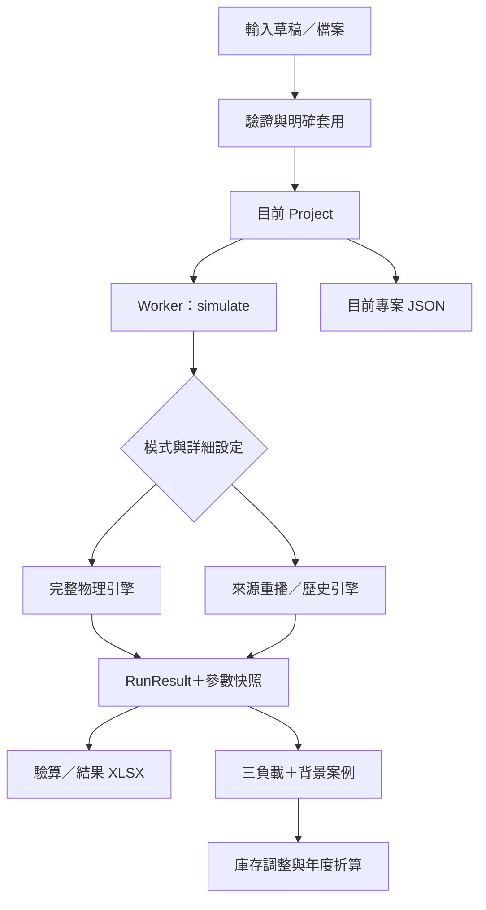
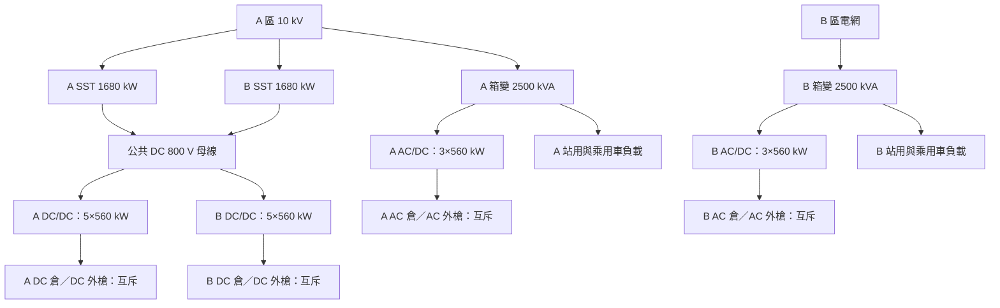

# 02｜系統與模型設計說明

## 1. 設計目標與架構

系統把輸入、物理計算、財務與展示分離。React 工作台負責編輯與顯示；`packages` 保存資料契約與計算；Web Worker 執行模擬，避免主介面被長時間同步運算占用。計算完成後建立 `RunResult` 與 `parameterSnapshot`，圖表、驗算及結果匯出都取用此快照。



來源重播保留相容用途，不能作實際購電能力證明。新建一期專案使用 `detailed` 與 `CONSTRAINED` 模式；`simulate()` 選擇完整引擎。圖中年度流程表示六次結果的規劃彙整，不表示單次一般測算會自動完成年度全部案例。

## 2. 電氣拓撲設計



這張圖是計算連接關係，未表示保護裝置選型、接地或實際配線。程式以供電端、饋電端及兩條有向跨區路徑表示雙向支援，避免形成不支援的有向循環；所有路徑共用來源容量帳。

必要約束：單台 SST 對本側及跨側的供應總和不得超過額定；A 上游要同時負擔兩側 SST 與 A 箱變；B 電網不能經不存在的路徑接管 SST。DC/DC 合計額定高於 SST 來源時仍受來源限功率。AC 組與 DC 組各自互斥，不能把電池與槍的額定值當成可同時加總的輸出。

## 3. 額定與效率

在本期常數效率假設下：

```text
AC 支路購電 = AC/DC 的 DC 輸出 ÷ ηACDC ÷ η箱變
DC 支路購電 = DC/DC 輸出 ÷ ηDCDC ÷ ηSST
轉換損耗 = 輸入電量 − 輸出電量
箱變輸入有效功率上限 = 額定 kVA × 功率因數
箱變可用輸出上限 = 上式 × 箱變效率
槍功率上限 = min(額定 kW, 電壓 V × 電流 A / 1000, 上游可分配 kW)
```

預設每側箱變可用輸出為 `2500×0.99×0.98=2425.5 kW`；三台 AC/DC 滿載輸入 `1680/0.9535≈1761.93 kW`，再加其他滿額負載 760 kW，約短缺 96.43 kW。因此設備銘牌總量不能直接當成可持續營運能力。實際逐時負載率與額定滿載檢核是兩種不同分析。

單槍預設 `600×637.56/1000=382.536 kW`，低於 480 kW 額定。個別效率覆寫優先於全域；AC/DC 整機效率不再乘上已移除的 PCS 與舊轉換級。選用非線性物理模型時應依該模型邊界核算，不能把上述簡式再重複套入。

## 4. 電池與服務設計

預設線性 SOC 電量式為 `E=C×SOH×SOC`；沒有逐艙覆寫且 SOH=1 時，513 kWh、20%→100% 的補能窗口是 410.4 kWh。逐艙能量—SOC 曲線存在時，採該曲線求能量及反解 SOC；SOC 比例差不能取代非線性能量差。

逐時資料保存總需求 kWh，展開事件時依同類車次均分。車流帶有 AC 子集時，分支按允許電池倉／槍端點配對，DC 需求由總量扣 AC 求得。不能因後來修改 SOH、容量或 SOC，就默默縮小已輸入需求；不相容請求保留排隊與未完成量。使用者明確按「套用 SOC」是另一個操作，會重算該站全期換電需求。

事件執行會追蹤到站、等待、開始、完成與電池身份。時間步進在完整模型內受事件邊界及最長一分鐘限制；換電 7.5 分鐘是作業時間，不是全引擎固定積分步長。回充、服務結束、功率分段、停機等事件需在正確時點更新。

## 5. 能量帳與守恆邊界

| 帳本 | 核對方法 | 避免的錯誤 |
|---|---|---|
| 元件／連線 | 輸入、輸出、損耗及連接殘差 | 把串接中間輸出再當全站新增能源 |
| 電網外部邊界 | 外部供能、外售、負載、損耗、儲能變化 | 把 ESS 放電當新購電，或把回充再加一次 |
| 換電營運 | 換出／換入淨能量、電池庫存變化、補電與內損 | 把初始满電库存消耗當可重複售電 |

一般關係為「外部輸入−外部輸出−損耗−庫存增加＝殘差」。具體項目依模型端點與帳本選用；營運交付與電池倉吸收是不同邊界，不可在同一等式重複相加。

連續功率採 `[起點,終點)` 積分；容量衰減溢出等離散損失使用 `(起點,終點]`。期末關帳另有完成事件歸屬規則，詳見 [能量流說明](../ENERGY_FLOW_UI.md) 與 [完整模型手冊](../COMPLETE_MODEL_GUIDE.md)。SOC 在累計模式顯示終點狀態，不是區間平均 SOC。

## 6. 十年營運折算

1. 同一套一期設備分別執行高／中／低負載，每組連續三天。
2. 各負載對應再執行三天背景案例，移除這批逐時重卡需求，保留其他負載與其價格條件。
3. 對 AC／DC 支路分別核對三日期初、期末電池庫存。若淨消耗初始庫存，从規劃供應量與相應估計收入扣除；原始物理結果不變。
4. 設 `B=營運日×代表日占比`，`I=營運日−B`。年度供應採調整後需求日日均值×B；購電與電量費採需求日日均×B＋背景日日均×I。
5. 需求、估計供應、缺口並列；存在不可歸屬的人工換電、其他庫存消耗或缺帳時保留不可用狀態。占比大於 1 不當成已驗證年產能。

此法修正重複使用期初庫存的偏差，但仍不是排隊穩態證明。2027 為低、2028–2029 為中、2030–2036 為高；需求成長與設備擴充是獨立概念，本基準十年不自動擴充。

## 7. SST 對箱變＋PCS 的效率收益

比較兩條路徑：`SST→原DC/DC` 與 `替代箱變→PCS→同一DC/DC`，保持客戶端 DC 交付量一致。替代設備假設容量足夠；沒有把其負載搬到既有 AC/DC 支路。

對各 SST 來源 `s`，由實際帳本取得輸入 `Is`、母線輸出 `Os`；兩側 DC/DC 群總輸出記為 `Q`：

```text
替代購電 Ip = Σ[Os / (η對應區箱變 × ηPCS)]
ηSST路徑 = Q / ΣIs
ηPCS路徑 = Q / Ip
年度節電 = 調整後 DC 年供應 D × (1/ηPCS路徑 − 1/ηSST路徑)
年度省電費 = 年度節電 × 每度電價值
累計省電費 = 各年度省電費以原精度加總
```

跨區支援按 SST 來源加權，不能依受電側錯配箱變效率。預設 SST 路徑為 95.452%，PCS 路徑為 93.54296%；這是效率鏈的結果，不是 95.35% AC/DC 效率的替代名稱。

比較可出現正、零或負差額。缺乏可信能量流或啟用 ESS／PV／備援、線損、曲線、非線性箱變、補償模型時，簡化比較停用並留空。既有物理測算仍可依完整模型進行。

## 8. 資料與儲存設計

現行應用程式不依賴業務資料庫；`db/schema.ts` 為空，存在 Drizzle 與 D1 範本不表示已建置資料服務。來源 JSON 是可攜資料真相；瀏覽器記憶中的專案與結果需使用者匯出保存。

`Project` 保存設備、站務、需求、效率、seed、模式及規劃設定；`RunResult` 保存實際帳本與成功時的輸入。XLSX 中 `Project_JSON` 用於還原設計，不從任意修改過的展示工作表反推出完整模型。當前十年 CSV／JSON與最後結果 XLSX 的資料時間點不同，操作人員必須記錄其基準。

## 9. 設計限制

本系統是參數化、確定性的準靜態能源與營運模型，未提供完整 AC 潮流、電磁暫態、SST 環流、廠商並聯控制驗證、保護選擇性證明或最優 EMS 證明。這些限制不以頁面圖示或增加參數欄位消除；後續需依 [待辦清單](10_ISSUES_DECISIONS.md) 補規格與實測。
